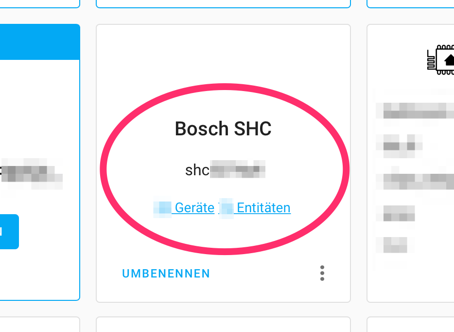

# boschshc-hass

Home Assistant component for accessing Bosch Smart Home Controller (SHC) using [boschshcpy](https://github.com/tschamm/boschshcpy) python library.

The following platforms are implemented:

* SmartHomeController (as a device)
* Smart Plug (switch)
* Light Control (switch)
* Shutter Control (cover)
* Shutter Contact (binary sensor)
* Smoke Detector (binary sensor)
* Thermostat and Wall Thermostat Sensor (sensor)
* Room Climate Control (climate)
* Intrusion Detection Control (Alarm Control Panel)
* Scenarios (as service)

# Configuration

Configuration of the component `bosch_shc` is done via config flow mechanism, either by `zeroconf` detection or by manual configuration:

If the `SHC` is running in the same network as the `HomeAssistant`, it is even found directly via `zeroconf`.

### Configuration of the discovered integration

#### 1.) Discovered integration

#### 2.) Confirmation of host

#### 3.) Enter credentials: public and private certificate key pair

#### 4.) Successful configuration entry created

#### 5.) Integration is listed as a configured integration

# Additional information

Follow this [thread](https://community.home-assistant.io/t/bosch-smart-home/115864) for discussions on the Bosch Smart Home Controller Home Assistant integration.
