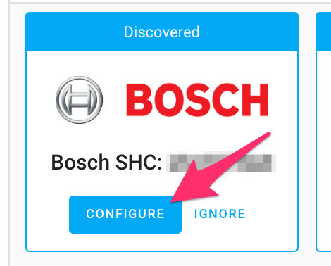
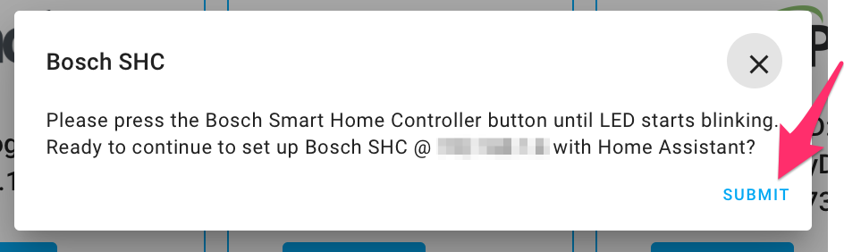
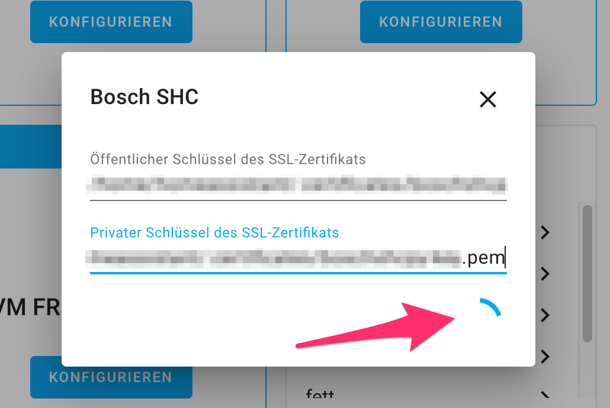

[![Validate with hassfest][hassfestbadge]][hassfest]
[![hacs_badge][hacsbadge]][hacs]
<!-- [![Validate with HACS][validatehacsbadge]][validatehacs] -->

[![BuyMeCoffee][buymecoffeebadge]][buymecoffee]
[![Stars][stars-shield]][bosch_shc]

# Bosch Smart Home Controller (SHC) for Home Assistant

Custom Home Assistant integration for accessing Bosch Smart Home Controller (SHC).

The integration is using [boschshcpy](https://github.com/tschamm/boschshcpy) as backend towards the API.

The SmartHomeController is added as a device. The component provides access to:

* Service calls:
  * `bosch_shc.trigger_scenario` service call to trigger a scenario by its name
  * `bosch_shc.smokedetector_check` service call to trigger a check routine of the smokedetector
* `bosch_shc.event` events:
  * Button events for Universal Switches devices (lower and upper button, short and long press)
  * Scenario events for triggered scenarios registered in SHC device, each scenario is identified by its name
  * Motion events for detected motion triggered by Motion Detector devices
  * Alarm events for alarms triggered by Smoke Detector devices or by Smoke Detection System

The following platforms are implemented:

* Alarm Control Panel
  * Intrusion Detection System
* Binary Sensor
  * Battery: all battery powered devices
  * Shutter Contact
  * Smoke Detector Gen 1 and Gen 2
  * Motion Detector
  * Smoke Detection System
  * Water Leakage Sensor
* Climate
  * Room Climate Control
* Cover
  * Shutter Control
* Light
  * LEDVANCE Light
* Sensor
  * Thermostat
  * Wall Thermostat Gen 1 and Gen 2
  * Twinguard
  * Smart Plug, Smart Plug Compact and Light Control (energy and power)
* Switch
  * Smart Plug
  * Smart Plug Compact
  * Light Control

# Installation

For installation, follow these steps to add Bosch Smart Home devices to `HomeAssistant`.

1. Install bosch_shc custom component
2. Configure bosch_shc integration in HA.

1.) To install `bosch_shc` as custom component, inside your HA configuration directory create a new folder called  `custom_components`. This is the folder that Home Assistant will look at when looking for custom code. Install the custom component there:
Just copy paste the content of the `boschshc-hass/bosch_shc` folder in your  `config/custom_components`  directory. As example, you will get the  `entity.py`  file in the following path:  `config/custom_components/bosch_shc/entity.py`.
Afterwards, restart `HomeAssistant`.

2.) For configuration of `bosch_shc` custom component, follow the steps described in [configuration](#configuration). During configuration, you have to enter the password of your SHC, which you defined during setup of your SHC.

# Configuration

Configuration of the component `bosch_shc` is done via config flow mechanism, either by `zeroconf` detection or by manual configuration:

If the `SHC` is running in the same network as the `HomeAssistant`, it is even found directly via `zeroconf`.

### Configuration of the discovered integration

#### 1.) Discovered integration
Press *configure* to start the configuration process.

#### 2.) Confirmation of host
**Hint:** Please press the Bosch SHC's front-side button until LEDs begin flashing. This will put the SHC into client registration mode, so new clients can be added to communicate with the SHC.

Press *submit* to continue.

#### 3.) Enter credentials: System password
Use the **system password** of your Bosch Smart Home Controller, which you created upon initial setup of the SHC.

Press *submit* to continue.

#### 4.) Successful configuration entry created
You can define areas of all supported devices.

Press *finish* to end the configuration process.

# Additional information

Follow this [thread](https://community.home-assistant.io/t/bosch-smart-home/115864) for discussions on the Bosch Smart Home Controller Home Assistant integration.

# Known Issues

* Encrypted SSL private key is not supported due to limitations of `requests` library.
* The integration is not (yet) async.
* After adding new devices to SHC, reloading the component is necessary before these devices appear in HomeAssistant.
* Hue Lights added to SHC do not appear in HomeAssistant. Please use the provided [hue component](https://www.home-assistant.io/integrations/hue/) instead.
* Arming and disarming of alarm control panel does not support using a code.
* Client certificate renewal is manual. A warning (log + persistent notification) appears 30 days before the stored client certificate expires; after expiry the integration requires re-auth (put controller in pairing mode and reconfigure). A daily background check runs to surface warnings without requiring a restart.

[buymecoffee]: https://www.buymeacoffee.com/tschamm
[buymecoffeebadge]: https://img.shields.io/badge/buy%20me%20a%20double%20espresso-donate-yellow.svg
[hassfestbadge]: https://github.com/tschamm/boschshc-hass/workflows/Validate%20with%20hassfest/badge.svg
[hassfest]: https://github.com/tschamm/boschshc-hass/actions/workflows/hassfest.yaml
[validatehacsbadge]: https://github.com/tschamm/boschshc-hass/workflows/Validate%20for%20HACS/badge.svg
[validatehacs]: https://github.com/tschamm/boschshc-hass/actions/workflows/hacs.yaml
[hacs]: https://github.com/custom-components/hacs
[hacsbadge]: https://img.shields.io/badge/HACS-Default-orange.svg
[bosch_shc]: https://github.com/tschamm/boschshc-hass
[stars-shield]: https://img.shields.io/github/stars/tschamm/boschshc-hass
