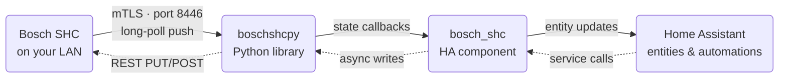
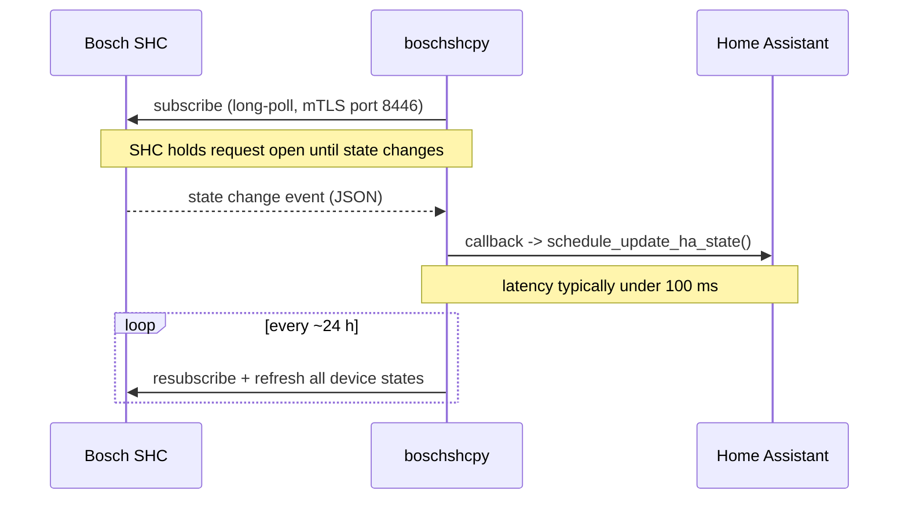

[![Validate][validatebadge]][validateworkflow]
[![Tests][testsbadge]][testsworkflow]
[![Quality][qualitybadge]][qualityworkflow]
[![hacs_badge][hacsbadge]][hacs]
[![Stars][stars-shield]][bosch_shc]

[![Buy tschamm a coffee][buymecoffeebadge-tschamm]][buymecoffee-tschamm]
[![Buy mosandlts a coffee][buymecoffeebadge-mosandlts]][buymecoffee-mosandlts]

# Bosch Smart Home Controller (SHC) for Home Assistant


A **local-only** Home Assistant integration for the Bosch Smart Home Controller (SHC I & II).
It talks directly to the controller over mutual-TLS on your LAN — **no cloud, no polling**
(`local_push`) — using [boschshcpy](https://github.com/tschamm/boschshcpy) as the API backend
(the exact version is pinned in [`manifest.json`](custom_components/bosch_shc/manifest.json)).

> Looking for the version that ships *inside* Home Assistant Core? This HACS repo is the
> **bleeding-edge** upstream — fixes and new devices land here first, then flow to Core later.

[](https://my.home-assistant.io/redirect/hacs_repository/?owner=tschamm&repository=boschshc-hass&category=integration)

---

## Contents

- [Highlights](#highlights)
- [Quick start](#quick-start)
- [Installation](#installation)
- [Configuration](#configuration)
- [Supported platforms](#supported-platforms)
- [Supported devices](#supported-devices)
- [Services / actions](#services--actions)
- [Data updates](#data-updates)
- [Troubleshooting](#troubleshooting)
- [Removal](#removal)
- [Known limitations](#known-limitations)
- [Use cases](#use-cases)
- [Automation examples](#automation-examples)
- [Architecture](#architecture)
- [Quality](#quality)
- [What's new](#whats-new)
- [Maintainers & support](#maintainers--support)

---

## Highlights

- 🔒 **Local & private** — mutual-TLS to the SHC, real-time push updates, nothing leaves your network.
- 🧩 **Broad device coverage** — thermostats, shutters/blinds (with tilt), micromodules, plugs,
  lights, cameras, Twinguard, smoke & intrusion, motion, contacts, water-leak, EMMA, and more.
- ⚙️ **Rich options flow** — suppress unwanted sensors/switches, expose scenarios as buttons,
  presence-based child lock and thermostat silent mode, device/room filter, and connection tuning —
  all with safe defaults (existing setups are never changed).
- 🌍 **30 languages** for the configuration UI.
- 🏅 **Home Assistant Gold** quality scale (Platinum in progress).

---

## Quick start

> **Requirements:** Home Assistant 2026.7 or later · Bosch SHC (I or II) on the same LAN · [HACS](https://hacs.xyz) installed.

**1 — Install via HACS**

Click the button below, or open **HACS → Integrations**, search for **Bosch SHC**, install, then restart Home Assistant.

[](https://my.home-assistant.io/redirect/hacs_repository/?owner=tschamm&repository=boschshc-hass&category=integration)

**2 — Put the SHC into registration mode**

Press and hold the button on the front of the SHC until the LEDs flash (~10 s).

**3 — Add the integration**

Go to **Settings → Devices & Services**. The SHC appears under *Discovered* — click **Configure**.
If it doesn't auto-discover, click **+ Add integration** and search for *Bosch SHC*, then enter the SHC's IP address.

**4 — Enter your system password**

The password you set when first setting up the SHC in the Bosch Smart Home app.

**5 — Done**

All paired devices are discovered automatically. Customise what gets created under
**Settings → Devices & Services → Bosch SHC → Configure**.

> If the SHC doesn't appear automatically, verify that Home Assistant and the SHC are on the same subnet — auto-discovery uses mDNS/zeroconf which doesn't cross router boundaries.

---

## Installation

### HACS (recommended)

1. Open **HACS → Integrations**, search for **Bosch SHC**, and install it.
2. Restart Home Assistant.
3. Go to **Settings → Devices & Services** and set up **Bosch SHC** (see below).

### Manual (no HACS)

1. Download the source zip of the [latest release](https://github.com/tschamm/boschshc-hass/releases/latest)
   and unzip it (the green **Code → Download ZIP** works too).
2. Copy `custom_components/bosch_shc/` into `<config>/custom_components/bosch_shc/`
   (create `custom_components/` if it doesn't exist).
3. Restart Home Assistant. On restart HA reads `manifest.json` and automatically
   pip-installs the pinned `boschshcpy` library — no manual Python steps needed,
   as long as the HA host has internet access.
4. Follow the setup steps below.

> **Updating:** delete the old `custom_components/bosch_shc/` folder first (so no stale
> files remain), copy the new one in, then restart. Your config entry and certificate
> pairing are preserved. Manual installs don't auto-update — re-copy the folder per release.

---

## Configuration

The SHC is auto-discovered via **zeroconf** — if it's on the same network it appears under
**Settings → Devices & Services → Discovered**. Otherwise add it with **+ Add integration →
Bosch SHC**.

### Initial setup

1. Press *Configure* on the discovered entry (or add it manually).
2. **Confirm host** — before submitting, press the button on the front of the SHC until the LEDs
   flash. This puts the controller into client-registration mode.
3. **System password** — the password you set when first setting up the SHC.
4. **Done** — the entry is created and all paired devices are discovered.


### Reconfigure (host change or certificate re-pair)

**Settings → Devices & Services → Bosch SHC → ⋮ → Reconfigure** offers:

- **Change host / IP** — update the SHC address without re-pairing.
- **Re-pair (regenerate certificate)** — full re-registration for a new SHC or after a factory reset.

### Options

**Settings → Devices & Services → Bosch SHC → Configure** — grouped into three collapsible sections.
**Every option defaults to the previous behaviour, so existing setups are never changed.**

Options marked with ★ are shown only when the relevant devices are connected to your SHC.

#### Features

| Option | Default | What it does |
|---|---|---|
| Scenarios as buttons | off | Expose each SHC scenario as a `button` entity |
| Scenario filter ★ | (all) | Allow-list — only the selected scenarios become buttons; stale IDs are auto-cleared |
| Diagnostic entities | on | Create battery-level, valve-tappet and comm-quality diagnostic sensors |
| Rawscan service | on | Register the `bosch_shc.trigger_rawscan` action; turn off to hide it |
| Suppress power sensors | off | Hide the watt + kWh sensors on Smart Plugs, Compact Plugs, and EMMA |
| Suppress camera switches ★ | off | Hide the privacy / light / notification switches for Camera Eyes, 360, and Outdoor Gen2 |
| Suppress Hue lights ★ | off | Hide lights paired through the SHC Hue bridge |
| Suppress LEDVANCE lights ★ | off | Hide LEDVANCE lights paired to the SHC |
| Suppress MD2 indicator light ★ | off | Hide the orientation-LED entity on Motion Detector II |
| Expose light relays as `light` ★ | off | Flip all BSM / Light Control II channels from `switch` to `light` domain |
| Expose selected relays as `light` ★ | (none) | Per-device picker — choose individual channels to expose as `light` |
| Enable per-room light groups | off | One aggregate `light` entity per SHC room with 2+ dimmable/color lights, to turn a whole room's lights on/off from a single entity — on/off only |

#### Presence & silent mode

| Option | Default | What it does |
|---|---|---|
| Child lock | off | Master toggle — child lock tracks presence below |
| Presence entities | (none) | Child lock turns **on** when **any** chosen entity is home, **off** when **all** are away. Supports `person`, `device_tracker`, `binary_sensor`, `input_boolean`, `zone`, `group` |
| Silent mode | off | Automatically put thermostat valves into silent (no-tick) mode during the configured window |
| Silent mode start | 22:00 | Start of the silent window |
| Silent mode end | 06:00 | End of the silent window |

#### Advanced

| Option | Default | What it does |
|---|---|---|
| Excluded devices | (none) | Hide specific SHC devices — no entities are created for them |
| Excluded rooms | (none) | Hide all devices in a room |
| Long-poll timeout | 10 s | How long each long-poll request waits before reconnecting (5–60 s) |
| Verify SHC certificate hostname | off | The SHC certificate hostname rarely matches its LAN IP — leave off unless you know why |
| Skip SSL verification | off | Disable TLS certificate verification entirely — only for unusual network setups |

### Translations

The configuration UI ships in **30 languages**: bg, ca, cs, de, el, en, es, es-419, et, fr, he,
hu, id, it, ja, ko, lv, nb, nl, no, pl, pt, pt-BR, ru, sk, sv, tr, uk, zh-Hans, zh-Hant.

---

## Supported platforms

| Platform | Devices / features |
|---|---|
| `alarm_control_panel` | Intrusion Detection System |
| `binary_sensor` | Shutter Contact (Gen 1 + Gen 2), Motion Detector (Gen 1 + Gen 2 [+M]), Smoke Detector (Gen 1 + Gen 2), Smoke Detection System, Water Leakage Sensor, Shutter Contact 2 Plus (vibration), Twinguard smoke alarm, Battery state (all battery devices) |
| `button` | Micromodule Relay (impulse/momentary), Scenarios (optional), Smoke Detector self-test, Motion Detector II Walk/Detection Test (start/stop) & Reset Tamper |
| `climate` | Room Climate Control (thermostat valve groups), Heating Circuit |
| `cover` | Shutter Control (BBL), Micromodule Shutter, Micromodule Awning, Micromodule Blinds (with tilt) |
| `event` | Universal Switch (WRC2 / SWITCH2) button presses, Scenarios, Motion events, Smoke Detector & Smoke-Detection-System alarm events |
| `light` | LEDVANCE lights (on/off, brightness, color), Hue (via SHC), Micromodule Dimmer, Motion Detector II indicator light, BSM / Light Control II (optional — see options) |
| `number` | Thermostat temperature offset |
| `select` | Motion Detector II (motion sensitivity, smart-sensitivity comfort/security levels, orientation-light response time, installation profile), Shutter Contact 2 Plus vibration sensitivity, Twinguard smoke sensitivity, thermostat/relay display & terminal config |
| `sensor` | Temperature, Humidity, CO₂/purity, Air-quality + rating (Twinguard), Energy + Power (Smart Plug / Compact, Light Control, Micromodule variants), Illuminance (Motion Detectors), Motion Detector II detection-test state, EMMA grid power, Battery level (diagnostic, optional) |
| `switch` | Smart Plug, Smart Plug Compact, Light Control, Micromodule Relay, Camera Eyes / 360 / Outdoor Gen2 (privacy, light, notification), Presence Simulation, Bypass (Shutter Contact 2), Child Lock, Pet Immunity & Tamper Protection (Motion Detector II), Smart Sensitivity (Motion Detector II), Silent Mode (thermostat), Vibration detection, User-Defined States |
| `valve` | Thermostat radiator valve (position, diagnostic) |

> [!TIP]
> **Bosch cameras?** This integration exposes the basics (privacy / light / notification switches, stream). For a lot more — snapshots, motion / FCM push events, light control and richer streaming — use the dedicated companion project: **[Bosch Smart Home Camera Tool](https://github.com/mosandlt/Bosch-Smart-Home-Camera-Tool-HomeAssistant)**. The two run side by side. (When a camera is present, the integration also shows a one-time, dismissible suggestion pointing there.)

---

## Supported devices

### Controller

| Model | Status |
|---|---|
| Bosch Smart Home Controller II (SHC II) | ✅ Supported |
| Bosch Smart Home Controller I (SHC I) | ✅ Supported |
| Bosch Smart Home Controller Classic | ✅ Supported |

Both SHC I and SHC II support the same local REST API. The only difference is the registration procedure: **Controller II** requires a short button press; **SHC I / Classic** requires pressing and holding the front button until the LEDs start flashing.

### Accessories

The following device families are supported. Devices not in this list are either
unsupported or may appear only as partial entries (e.g. a device paired to the SHC but
not yet implemented in this integration).

| Device family | Entity types created |
|---|---|
| Room Climate Controller (BWTH/BWTH24) | `climate`, `sensor` (temperature, humidity), `number` (temperature offset), `valve` (tappet position, diagnostic) |
| Room Thermostat (wall-mounted) | `climate`, `sensor` (temperature, humidity), `number` (temperature offset) |
| Heating Circuit | `climate`, `number` (eco + comfort setpoints) |
| Shutter Control (BBL) / Micromodule Shutter / Awning | `cover` (position) |
| Micromodule Blinds | `cover` (position + tilt), `sensor` (power, energy) |
| Shutter Contact I | `binary_sensor` (window/door open state) |
| Shutter Contact II | `binary_sensor` (open state), `switch` (bypass) |
| Shutter Contact 2 Plus | `binary_sensor` (open state, vibration), `select` (vibration sensitivity), `switch` (bypass, vibration enabled) |
| Motion Detector I | `binary_sensor` (motion), `sensor` (illuminance), `event` (motion) |
| Motion Detector II / II [+M] | `binary_sensor` (motion, occupancy, tamper), `sensor` (temperature, illuminance, walk/detection-test state¹), `select` (sensitivity, orientation-light, installation profile), `switch` (tamper protection, pet immunity, smart sensitivity), `button` (walk test start/stop, tamper reset), `light` (indicator LED), `event` (motion) |
| Smoke Detector I | `binary_sensor` (alarm), `event` (alarm events), `button` (self-test) |
| Smoke Detector II | `binary_sensor` (alarm), `event` (alarm events), `button` (self-test), `switch` (intrusion alarm — sounds this detector's own siren only²) |
| Twinguard | `sensor` (temperature, humidity, CO₂/purity, combined rating), `binary_sensor` (smoke alarm), `select` (smoke sensitivity), `button` (smoke test) |
| Smoke Detection System | `binary_sensor` (aggregate alarm state), `event` (alarm events) |
| Outdoor Siren | `binary_sensor` (acoustic alarm, visual alarm, tamper), `sensor` (battery %, power source, solar quality), `button` (test alarm), `number` (alarm/flash duration + delay), `select` (sound level) |
| Smart Plug (PSM) | `switch`, `sensor` (power, energy) |
| Smart Plug Compact (PSM Compact) | `switch`, `sensor` (power, energy) |
| Light Control / Micromodule Relay (BSM) | `switch` (or `light` — opt-in per device), `sensor` (power, energy) |
| Micromodule Dimmer | `light` (brightness) |
| LEDVANCE lights (ZigBee via SHC) | `light` (on/off, brightness, color) |
| Hue lights (via SHC Hue bridge) | `light` (on/off, brightness, color) |
| Water Leakage Sensor | `binary_sensor` (moisture) |
| Universal Switch (WRC2 / SWITCH2) | `event` (button press: upper/lower, short/long) |
| Camera Eyes | `switch` (privacy, light, notification) |
| Camera 360 | `switch` (privacy, notification) |
| Outdoor Camera Gen2 | `switch` (privacy, front light, ambient light) |
| EMMA (Energy Management Module A) | `sensor` (grid power) |
| Scenarios | `button` (optional, one per scenario), `event` (always, one per scenario) |
| User-Defined States | `switch` (one per user-defined state) |
| Intrusion Detection System | `alarm_control_panel` |

> ¹ Disabled by default — enable per-entity in **Settings → Devices & Services → [device] → Diagnostics**.
>
> ² The Smoke Detector II **intrusion alarm** switch writes `INTRUSION_ALARM_ON_REQUESTED`
> to that single device. Verified on hardware: it sounds (and silences) **only that one
> detector's** siren — it does **not** cascade to other smoke detectors / Twinguards and
> raises **no** Bosch app notification. There is no local-API way to force the whole
> intrusion-alarm system (`SurveillanceAlarm` is read-only); the IDS only supports
> arm / disarm / mute. Treat this switch as a single-device siren, not a system alarm.
>
> Devices not listed (e.g. third-party ZigBee or Z-Wave accessories not
> from Bosch) may be physically paired to the SHC but are not surfaced by
> this integration.

---

## Services / actions

| Action | Description |
|---|---|
| `bosch_shc.trigger_scenario` | Trigger a scenario by name |
| `bosch_shc.trigger_rawscan` | Dump raw JSON from the SHC (devices, services, rooms, scenarios, …) — see [Creating a rawscan](#creating-a-rawscan-for-bug-reports) |
| `bosch_shc.smokedetector_check` | Trigger a self-test on a Smoke Detector entity |
| `bosch_shc.smokedetector_alarmstate` | Set the alarm state on a Smoke Detector entity |

Events are fired on the `bosch_shc.event` bus — button presses (Universal Switch: lower/upper,
short/long), scenario triggers, motion events, and smoke-detector alarms.

---

## Data updates

The SHC exposes a **long-poll REST API** on port 8446 (mTLS). The integration
maintains a persistent connection: the SHC holds the request open until a state
change occurs, then responds immediately with the changed values. This gives
**near-real-time** push updates — typically under 100 ms — without polling.

- **No polling interval** — state changes arrive as push events. `should_poll = False`
  on all entities (exception: camera-type switches and motion derived from timestamps,
  which set `should_poll = True` for their specific sensors).
- **Reconnect** — if the connection drops (network glitch, SHC restart), the library
  automatically reconnects and re-subscribes. A warning is logged on disconnect; an
  info message confirms reconnection.
- **Long-poll timeout** — configurable in Options → Advanced (default: 10 s). Lower
  values increase responsiveness after a network glitch; higher values reduce chatter.

---

## Troubleshooting

### Common setup errors

| Error | Cause | Fix |
|---|---|---|
| `cannot_connect` | SHC not reachable at the given IP | Check IP, firewall; try ping from HA host |
| `pairing_failed` | SHC not in registration mode when credentials were submitted | Press the SHC front button until LEDs flash, then retry |
| `session_error` | Certificate or session rejected | Re-pair via **Reconfigure → Re-pair credentials** |
| `invalid_auth` | Wrong system password | Re-enter the password set during initial SHC app setup |
| `RequirementsNotFound: boschshcpy` | PyPI mirror lag after a release | Wait 5–10 min and reload; or manually install the pinned version |
| Entities not appearing after adding a device | SHC API does not push device-added events | **Bosch SHC → ⋮ → Reload** |
| Certificate expiry repair issue | Client cert expires after ~10 years | Follow the repair flow or use **Reconfigure → Re-pair** |

### Bug reports

The fastest path to a fix is data. In order of convenience:

1. **Download diagnostics** — **Bosch SHC → ⋮ → Download diagnostics**. A redacted JSON snapshot
   of every device and its raw state (credentials, host/IP, MAC and serials removed automatically).
2. **A rawscan** of the misbehaving device — see below.
3. **Debug logs** captured while reproducing — see below.

Attach the file to your GitHub issue and remove anything you consider private.

### Creating a rawscan (for bug reports)

A rawscan is the raw JSON the controller exposes for a device — the single most useful thing to
attach when a device behaves wrong.

**1. Find the device id** — in **Developer Tools → Actions**:

```yaml
action: bosch_shc.trigger_rawscan
data:
  command: devices
```

Copy the device's `"id"` (e.g. `hdm:ZigBee:000d6f0000abcdef`).

**2. Dump that device's services:**

```yaml
action: bosch_shc.trigger_rawscan
data:
  command: device_services
  device_id: hdm:ZigBee:000d6f0000abcdef
```

Valid `command` values: `devices`, `device_services`, `device_service` (needs `device_id` +
`service_id`), `services`, `scenarios`, `rooms`, `information`, `public_information`,
`intrusion_detection`, `userdefinedstates`. For multiple controllers add `title: <name>`.

> The same data is available from the CLI via the `boschshc_rawscan` script shipped with
> [`boschshcpy`](https://github.com/tschamm/boschshcpy) (needs the client certificate + key).

### Enabling debug logs

**UI (easiest):** **Bosch SHC → ⋮ → Enable debug logging**, reproduce, then **Disable debug
logging** — HA downloads the log automatically (captures both the integration and `boschshcpy`).

**YAML:**

```yaml
logger:
  default: info
  logs:
    custom_components.bosch_shc: debug
    boschshcpy: debug
```

---

## Removal

1. **Bosch SHC → ⋮ → Delete**, then restart Home Assistant.
2. **Manual cleanup:** the client certificate/key files in `/config/bosch_shc/`
   (`bosch_shc-cert_<hostname>.pem` / `bosch_shc-key_<hostname>.pem`) are **not** removed
   automatically — delete them if you no longer use the integration.

---

## Known limitations

- **Local-only** — the integration talks directly to the SHC on your LAN. Remote access
  (from outside the home network) is not possible without a VPN or similar tunnel.
- **No hot-plug** — new physical devices paired in the Bosch app only appear in HA after
  reloading the integration (**Bosch SHC → ⋮ → Reload**) or restarting Home Assistant.
  The SHC API does not push device-added events.
- **Encrypted SSL private keys are not supported** — a limitation of the underlying
  TLS library. Keys generated by the registration flow are unencrypted and work fine.
- **Alarm control panel PIN** — arming/disarming via HA does not require (or support)
  a PIN code, regardless of whether one is set in the Bosch app.
- **Light Control II / Hue bridge devices** — exposed as `switch` by default to avoid
  accidental platform conflicts; opt in per device via Options → Expose light relays.
- **Certificate expiry** — client certificates expire after approximately 10 years.
  A repair issue appears 30 days before expiry; after expiry, re-pair via
  **Bosch SHC → ⋮ → Reconfigure → Re-pair credentials**.
- **Camera stream** — only the privacy / light / notification switches are exposed.
  For snapshots, motion events and richer camera control use the companion
  [Bosch Smart Home Camera Tool](https://github.com/mosandlt/Bosch-Smart-Home-Camera-Tool-HomeAssistant).

---

## Use cases

### Home security

Combine the intrusion detection alarm panel with smoke detectors and water leakage sensors
for a unified safety dashboard. Use an automation to send a push notification (or activate
a siren) when `alarm_control_panel.bosch_shc` switches to `triggered`, and another to
alert on `binary_sensor.*_water_leakage` going `on`.

### Presence-based comfort

Use motion sensors from Motion Detector I/II as triggers to turn on lights or adjust
thermostats. The **child lock** option lets you track presence entities (people, device
trackers) and automatically lock/unlock thermostat controls when you leave or arrive.

### Energy monitoring

Smart Plugs and Compact Plugs expose real-time watt sensors and cumulative kWh sensors.
Add these to the **HA Energy dashboard** (Settings → Energy) for appliance-level consumption
tracking. The EMMA module can additionally report grid-level import/export power.

---

## Automation examples

### Trigger a scenario when you leave home

```yaml
automation:
  trigger:
    - platform: state
      entity_id: person.thomas
      to: not_home
  action:
    - action: bosch_shc.trigger_scenario
      data:
        name: "Away"
```

### Notify on smoke alarm

```yaml
automation:
  trigger:
    - platform: state
      entity_id: binary_sensor.twinguard_smoke  # entity_id depends on device name
      to: "on"
  action:
    - action: notify.mobile_app_phone
      data:
        title: "⚠️ Smoke alarm"
        message: "Twinguard has detected smoke."
```

### Auto-arm intrusion system when leaving

```yaml
automation:
  trigger:
    - platform: state
      entity_id: person.thomas
      to: not_home
  action:
    - action: alarm_control_panel.alarm_arm_away
      target:
        entity_id: alarm_control_panel.bosch_shc  # entity_id depends on SHC name
```

### Motion-triggered lights (with timeout)

```yaml
automation:
  mode: restart
  trigger:
    - platform: state
      entity_id: binary_sensor.motion_detector  # entity_id depends on device name
      to: "on"
  action:
    - action: light.turn_on
      target:
        area_id: hallway
    - delay: "00:05:00"
    - action: light.turn_off
      target:
        area_id: hallway
```

---

## Architecture


```mermaid
graph LR
    SHC("Bosch SHC\non your LAN")
    LIB("boschshcpy\nPython library")
    INT("bosch_shc\nHA component")
    HA("Home Assistant\nentities & automations")

    SHC -->|"mTLS · port 8446\nlong-poll push"| LIB
    LIB -->|"state callbacks"| INT
    INT -->|"entity updates"| HA
    HA -.->|"service calls"| INT
    INT -.->|"async writes"| LIB
    LIB -.->|"REST PUT/POST"| SHC
```


```mermaid
sequenceDiagram
    participant SHC as Bosch SHC
    participant Lib as boschshcpy
    participant HA as Home Assistant

    Lib->>SHC: subscribe (long-poll, mTLS port 8446)
    Note over SHC,Lib: SHC holds request open until state changes
    SHC-->>Lib: state change event (JSON)
    Lib->>HA: callback -> schedule_update_ha_state()
    Note over Lib,HA: latency typically under 100 ms
    loop every ~24 h
        Lib->>SHC: resubscribe + refresh all device states
    end
```

---

## Quality

Targets the [Home Assistant **Gold** quality scale](https://developers.home-assistant.io/docs/integration_quality_scale_index/).
All Bronze + Silver + Gold rules implemented. Platinum progress tracked in `quality_scale.yaml`
(`scripts/check-quality-scale.py --tier platinum`).

- `local_push` IoT class — no cloud, no polling (camera-type devices update on poll only).
- Config flow with zeroconf discovery, re-auth, reconfigure and options flow.
- Unique config-entry enforcement, test-before-configure validation.
- Fully async — event-loop native; long-poll push via `SHCSessionAsync` (aiohttp).
- `runtime_data`, `has_entity_name = True`, `PARALLEL_UPDATES` on every platform.
- Entity + icon + exception translations (30 languages); repair issues for certificate expiry.
- Domain actions (`trigger_scenario`, `trigger_rawscan`) available even if an entry fails to load.
- Diagnostics download — redacted JSON snapshot of all device states.
- CI: hassfest + HACS validation, unit tests, ruff/codespell/pip-audit/pylint, CodeQL,
  secret scan, translation-completeness gate, quality-scale gate (Gold hard / Platinum informational).

---

## What's new

**0.7.28 — User-Defined States crash fix + SHC I/II/Classic all supported**

- **switch / lib** — Fix `KeyError: 'deleted'` crash on `SHCUserDefinedStateSwitch.available` when the SHC API omits the `deleted` field (present only when `True`). All User-Defined State switches now load correctly. Fixes #351. Requires boschshcpy 0.3.21.
- **Docs** — Corrected hardware compatibility: SHC I, SHC II, and SHC Classic all support the local REST API (registration differs: short press for SHC II, hold until LEDs flash for SHC I/Classic).

**0.7.27 — entity_id deprecation fix + CI / docs**

- **event / switch** — Remove all manual `self.entity_id` assignments (`SHCUniversalSwitchEvent`, `SHCLightControlButtonEvent`, `SHCScenarioEvent`, `SHCUserDefinedStateSwitch`). HA now generates entity IDs from `unique_id` — the modern, deprecation-safe approach. Existing installs are unaffected (HA persists entity IDs in the registry; the stored value is reused). Addresses #296.
- **CI** — Fix `homeassistant>=2026.6.4` in `requirements_test.txt` (unavailable on Python 3.13 CI); changed to `>=2026.2.0`. Tests now resolve to the latest Python-3.13-compatible HA version (2026.2.3).
- **Docs** — README restructured: HACS one-click install button, logical section order (Highlights → Quick start → Install → Config → Reference → Troubleshooting → Architecture → What's new), updated TOC.

**0.7.26 — Bug fixes + coverage gate**

Ten targeted bug fixes and CI hardening, paired with **boschshcpy 0.3.20**:

- **Climate** — skip `set_temperature` when `hvac_mode=AUTO`; Bosch rejects setpoints in schedule mode (previously caused a silent HTTP 400).
- **Number** — guard `step_size=None` in `native_step` (was `TypeError` on certain thermostat models).
- **Binary sensor** — smoke-detector sensors now properly unsubscribe their service callback on unload, and guard against unexpected enum values.
- **Event** — motion-detector events have a dedup guard (`_last_fired_timestamp`) to suppress phantom events caused by unrelated battery-level polls.
- **Switch** — `SHCUserDefinedStateSwitch.available` property added; was always `True` even after a user-defined state was deleted from the SHC.
- **CI** — coverage gate ≥ 95 % (current: **99.28 %**, 2939 tests, 20/22 files at 100 %).
- **Library** — `boschshcpy 0.3.20`: thread-safety `list()` copies in the long-poll callback loop + ruff CI gate.

**0.7.18 — Suppress & filter options**

Six new opt-in suppression toggles keep your entity list tidy. All default to **off** so nothing
changes for existing setups:

- **Suppress power sensors** — hides the watt + kWh sensors on plugs (Smart Plug, Compact, EMMA).
- **Suppress camera switches** — hides the privacy / light / notification switches for
  Camera Eyes, 360, and Outdoor Gen2 (useful when the
  [Camera Tool](https://github.com/mosandlt/Bosch-Smart-Home-Camera-Tool-HomeAssistant) is installed).
- **Suppress Hue lights** — hides lights paired through the SHC Hue bridge
  *(shown only when Hue devices are connected)*.
- **Suppress LEDVANCE lights** — hides LEDVANCE lights paired to the SHC
  *(shown only when LEDVANCE devices are connected)*.
- **Suppress MD2 indicator light** — hides the orientation LED entity on Motion Detector II
  *(shown only when MD2 devices are connected)*.
- **Scenario filter** — a multi-select allow-list; only the chosen scenarios become button entities
  (stale IDs are auto-cleared on reload) *(shown only when scenarios exist)*.
- **Expose light relay as `light`** — per-device picker (and a "flip all" toggle) to expose
  BSM / Light Control II channels as `light` entities instead of `switch`
  *(shown only when compatible light-relay devices are connected)*.

CI now enforces translation completeness for all 30 languages.

**0.7.15 — Fully async**

The integration is now event-loop-native — no executor round-trips for writes. This was the final
phase of a multi-release async migration.

**0.7 — Motion Detector II, climate polish**

- **Motion Detector II [+M] — full configuration parity with the Bosch app:**
  - **Detection (Walk) Test** — start/stop buttons + a state sensor, for verifying
    mounting/coverage. Works whether your device exposes the `DetectionTest` *or* the
    `WalkTest` service (the local API and the app use different names for the same feature).
  - **Tamper protection** — a switch to enable/disable it, a **Reset Tamper** button to
    clear an active tamper condition, and the existing tamper state sensor.
  - **Orientation-light response time** — a select (Long = lower battery use / Short =
    more responsive), backed by the `PollControl` service.
  - **Installation profile** — a writable select for the active detection
    environment (e.g. `GENERIC` / `OUTDOOR`); selecting an option writes the
    device-level profile via the local API.
- **Climate display polish** — preset icons (`auto`/`manual`/`eco`/`boost`) and a proper
  `translation_key`, plus `hvac_modes` ordered `[HEAT, (COOL), OFF]` so cards that hide
  modes after `OFF` (e.g. Mushroom thermostat) show the COOL button. *(thanks @jumlu)*

---

## Maintainers & support

| Role | GitHub |
|---|---|
| Original author & maintainer | [@tschamm](https://github.com/tschamm) |
| Co-maintainer | [@mosandlt](https://github.com/mosandlt) |

Community discussion: [Bosch Smart Home thread](https://community.home-assistant.io/t/bosch-smart-home/115864)
on the Home Assistant forum. Bugs and feature requests:
[open an issue](https://github.com/tschamm/boschshc-hass/issues).

If this integration is useful to you, consider buying the maintainers a coffee — it's appreciated! ☕

[![Buy tschamm a coffee][buymecoffeebadge-tschamm]][buymecoffee-tschamm]
[![Buy mosandlts a coffee][buymecoffeebadge-mosandlts]][buymecoffee-mosandlts]

<!-- link references -->
[bosch_shc]: https://github.com/tschamm/boschshc-hass
[validateworkflow]: https://github.com/tschamm/boschshc-hass/actions/workflows/validate.yml
[validatebadge]: https://github.com/tschamm/boschshc-hass/actions/workflows/validate.yml/badge.svg
[testsworkflow]: https://github.com/tschamm/boschshc-hass/actions/workflows/tests.yml
[testsbadge]: https://github.com/tschamm/boschshc-hass/actions/workflows/tests.yml/badge.svg
[qualityworkflow]: https://github.com/tschamm/boschshc-hass/actions/workflows/quality.yml
[qualitybadge]: https://github.com/tschamm/boschshc-hass/actions/workflows/quality.yml/badge.svg
[hacs]: https://github.com/hacs/integration
[hacsbadge]: https://img.shields.io/badge/HACS-Default-orange.svg
[stars-shield]: https://img.shields.io/github/stars/tschamm/boschshc-hass
[buymecoffee-tschamm]: https://www.buymeacoffee.com/tschamm
[buymecoffeebadge-tschamm]: https://img.shields.io/badge/buy%20tschamm%20a%20double%20espresso-donate-yellow.svg
[buymecoffee-mosandlts]: https://buymeacoffee.com/mosandlts
[buymecoffeebadge-mosandlts]: https://img.shields.io/badge/buy%20mosandlts%20a%20coffee-donate-yellow.svg
