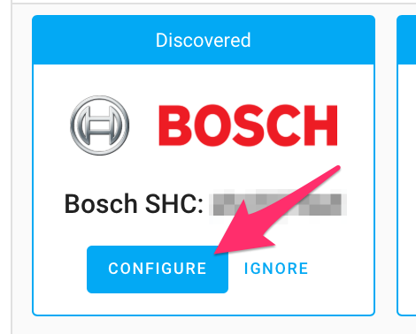
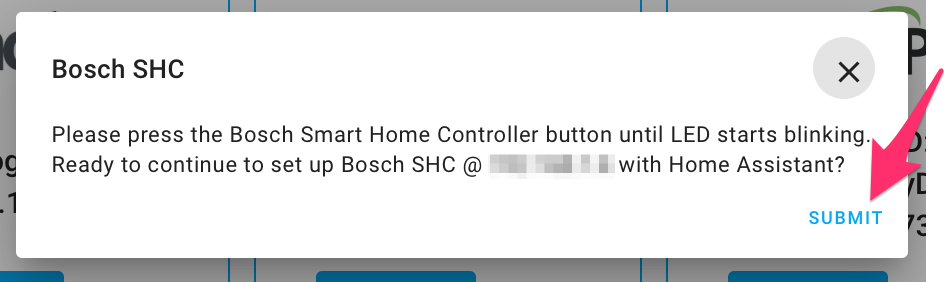
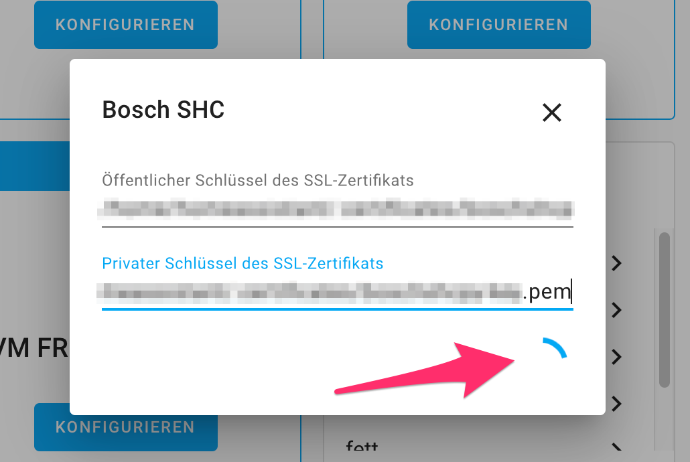
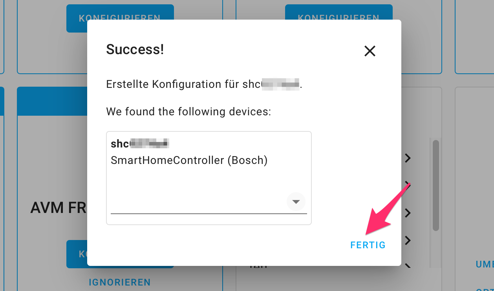
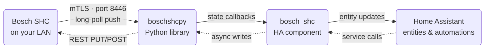
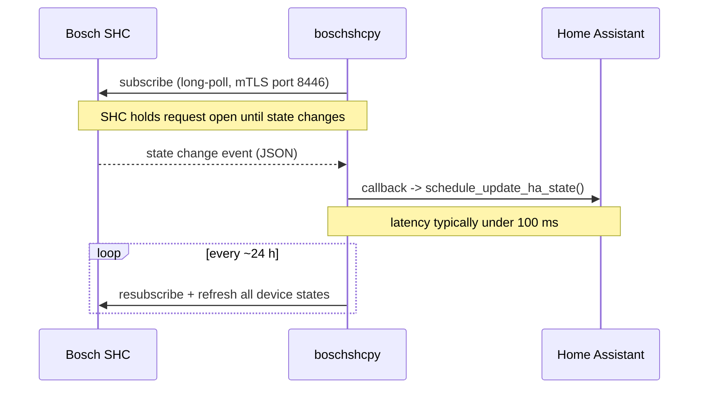

[![Validate][validatebadge]][validateworkflow]
[![Tests][testsbadge]][testsworkflow]
[![Quality][qualitybadge]][qualityworkflow]
[![hacs_badge][hacsbadge]][hacs]
[![Stars][stars-shield]][bosch_shc]

[![Buy tschamm a coffee][buymecoffeebadge-tschamm]][buymecoffee-tschamm]
[![Buy mosandlts a coffee][buymecoffeebadge-mosandlts]][buymecoffee-mosandlts]

# Bosch Smart Home Controller (SHC) for Home Assistant


A **local-only** Home Assistant integration for the Bosch Smart Home Controller (SHC I & II).
It talks directly to the controller over mutual-TLS on your LAN — **no cloud, no polling**
(`local_push`) — using [boschshcpy](https://github.com/tschamm/boschshcpy) as the API backend
(the exact version is pinned in [`manifest.json`](custom_components/bosch_shc/manifest.json)).

> Looking for the version that ships *inside* Home Assistant Core? This HACS repo is the
> **bleeding-edge** upstream — fixes and new devices land here first, then flow to Core later.

[](https://my.home-assistant.io/redirect/hacs_repository/?owner=tschamm&repository=boschshc-hass&category=integration)

---

## Contents

- [Highlights](#highlights)
- [Quick start](#quick-start)
- [Installation](#installation)
- [Configuration](#configuration)
- [Supported platforms](#supported-platforms)
- [Supported devices](#supported-devices)
- [Firmware updates](#firmware-updates)
- [Automation rules & whole-home controls](#automation-rules--whole-home-controls)
- [Services / actions](#services--actions)
- [Data updates](#data-updates)
- [Troubleshooting](#troubleshooting)
- [Removal](#removal)
- [Known limitations](#known-limitations)
- [Use cases](#use-cases)
- [Automation examples](#automation-examples)
- [Architecture](#architecture)
- [Quality](#quality)
- [What's new](#whats-new)
- [Maintainers & support](#maintainers--support)

---

## Highlights

- 🔒 **Local & private** — mutual-TLS to the SHC, real-time push updates, nothing leaves your network.
- 🧩 **Broad device coverage** — thermostats, shutters/blinds (with tilt), micromodules, plugs,
  lights, cameras, Twinguard, smoke & intrusion, motion, contacts, water-leak, EMMA, and more.
- 🔥 **Firmware updates in HA** — the controller and every firmware-capable device get a normal
  HA "Update available" notification with an Install button, no need to open the Bosch app.
- 🤖 **Bosch's own automation rules as HA entities** (opt-in) — enable/disable and trigger any
  rule you already built in the Bosch app, straight from Home Assistant.
- 🚨 **Alarm "Mute" buttons** for the intrusion system and the whole-home water-leak alarm.
- 🌡️ **Per-room temperature-drop (anti-frost) controls** and a **thermostat regulation-algorithm**
  select, mirroring the Bosch app's room-detail screen.
- 🚪 **Whole-home "Open Doors/Windows" summary sensor** — one glance at how many openings are open.
- ⚙️ **Rich options flow** — suppress unwanted sensors/switches, expose scenarios/automation rules
  as buttons, per-room light groups, presence-based child lock and thermostat silent mode,
  device/room filter, and connection tuning — all with safe defaults (existing setups are never
  changed).
- 🌍 **30 languages** for the configuration UI.
- 🏅 **Home Assistant Platinum** quality scale — all Bronze/Silver/Gold/Platinum rules done or exempt.

---

## Quick start

> **Requirements:** Home Assistant 2026.7 or later · Bosch SHC (I or II) on the same LAN · [HACS](https://hacs.xyz) installed.

**1 — Install via HACS**

Click the button below, or open **HACS → Integrations**, search for **Bosch SHC**, install, then restart Home Assistant.

[](https://my.home-assistant.io/redirect/hacs_repository/?owner=tschamm&repository=boschshc-hass&category=integration)

**2 — Put the SHC into registration mode**

**SHC II:** short press. **SHC I / Classic:** press and hold until the LEDs flash (~10 s).

**3 — Add the integration**

Go to **Settings → Devices & Services**. The SHC appears under *Discovered* — click **Configure**.
If it doesn't auto-discover, click **+ Add integration** and search for *Bosch SHC*, then enter the SHC's IP address.

**4 — Enter your system password**

The password you set when first setting up the SHC in the Bosch Smart Home app.

**5 — Done**

All paired devices are discovered automatically. Customise what gets created under
**Settings → Devices & Services → Bosch SHC → Configure**.

> If the SHC doesn't appear automatically, verify that Home Assistant and the SHC are on the same subnet — auto-discovery uses mDNS/zeroconf which doesn't cross router boundaries.

---

## Installation

### Beta releases

New fixes/features land first as a **beta** release (`vX.Y.Z-beta.N`) before being
promoted to a stable release. Betas run through the exact same test/quality gate as a
stable release, so they're safe to try — this is how you can help test a fix before it
reaches everyone, or get a feature slightly earlier.

The latest beta is automatically promoted to a stable release every **Friday at 18:00
(Europe/Berlin)**, giving each beta at least a few days of real-world testing before it
becomes the default version everyone gets. In short, there are two release trains:

- **beta** — released as fixes/features land, for anyone who wants updates sooner.
- **stable** — a collection of that week's beta updates, promoted automatically every
  Friday. If a week has no new betas, there's no stable release that week either.

By default HACS only shows stable releases. To opt in to betas for this integration:

1. Go to **Settings → Devices & Services → Entities**, search for
   `switch.bosch_smart_home_controller_shc_integration_pre_release`, open it, and enable
   it — this switch is disabled by default, so it won't show up until you turn it on.
   Give HA a few seconds to pick it up.
2. Once enabled, HACS includes beta releases when checking for updates for this
   integration, and the beta version will show up as an available update like any other.
3. To go back to stable-only, just disable the entity again.

Prefer to install a specific beta (or any specific version) directly instead of waiting
for HACS to offer it? In HACS, open **Bosch SHC → ⋮ → Redownload → "Need a different
version?"** and pick the release you want.

### HACS (recommended)

1. Open **HACS → Integrations**, search for **Bosch SHC**, and install it.
2. Restart Home Assistant.
3. Go to **Settings → Devices & Services** and set up **Bosch SHC** (see below).

### Manual (no HACS)

1. Download the source zip of the [latest release](https://github.com/tschamm/boschshc-hass/releases/latest)
   and unzip it (the green **Code → Download ZIP** works too).
2. Copy `custom_components/bosch_shc/` into `<config>/custom_components/bosch_shc/`
   (create `custom_components/` if it doesn't exist).
3. Restart Home Assistant. On restart HA reads `manifest.json` and automatically
   pip-installs the pinned `boschshcpy` library — no manual Python steps needed,
   as long as the HA host has internet access.
4. Follow the setup steps below.

> **Updating:** delete the old `custom_components/bosch_shc/` folder first (so no stale
> files remain), copy the new one in, then restart. Your config entry and certificate
> pairing are preserved. Manual installs don't auto-update — re-copy the folder per release.

---

## Configuration

The SHC is auto-discovered via **zeroconf** — if it's on the same network it appears under
**Settings → Devices & Services → Discovered**. Otherwise add it with **+ Add integration →
Bosch SHC**.

### Initial setup

1. Press *Configure* on the discovered entry (or add it manually).
2. **Confirm host** — before submitting, put the SHC into client-registration mode: a short press
   on **SHC II**, or press-and-hold until the LEDs flash on **SHC I / Classic**.
3. **System password** — the password you set when first setting up the SHC.
4. **Done** — the entry is created and all paired devices are discovered.






### Reconfigure (host change or certificate re-pair)

**Settings → Devices & Services → Bosch SHC → ⋮ → Reconfigure** offers:

- **Change host / IP** — update the SHC address without re-pairing.
- **Re-pair (regenerate certificate)** — full re-registration for a new SHC or after a factory reset.

### Options

**Settings → Devices & Services → Bosch SHC → Configure** — grouped into three collapsible sections.
**Every option defaults to the previous behaviour, so existing setups are never changed.**

Options marked with ★ are shown only when the relevant devices are connected to your SHC.

#### Features

| Option | Default | What it does |
|---|---|---|
| Scenarios as buttons | off | Expose each SHC scenario as a `button` entity |
| Scenario filter ★ | (all) | Allow-list — only the selected scenarios become buttons; stale IDs are auto-cleared |
| Diagnostic entities | on | Create battery-level, valve-tappet, comm-quality and Zigbee-routing-quality diagnostic sensors — they're disabled by default in the entity registry regardless; press the **Enable All Diagnostics** button to enable every one for this SHC at once |
| Rawscan service | on | Register the `bosch_shc.trigger_rawscan` action; turn off to hide it |
| Suppress power sensors | off | Hide the watt + kWh sensors on Smart Plugs, Compact Plugs, and EMMA |
| Suppress camera switches ★ | off | Hide the privacy / light / notification switches for Camera Eyes, 360, and Outdoor Gen2 |
| Suppress Hue lights ★ | off | Hide lights paired through the SHC Hue bridge |
| Suppress LEDVANCE lights ★ | off | Hide LEDVANCE lights paired to the SHC |
| Suppress MD2 indicator light ★ | off | Hide the orientation-LED entity on Motion Detector II |
| Expose light relays as `light` ★ | off | Flip all BSM / Light Control II channels from `switch` to `light` domain |
| Expose selected relays as `light` ★ | (none) | Per-device picker — choose individual channels to expose as `light` |
| Enable per-room light groups | off | One aggregate `light` entity per SHC room with 2+ dimmable/color lights, to turn a whole room's lights on/off from a single entity — on/off only |
| Automation rules as entities | off | One `switch` (enable/disable) + one `button` (trigger now) per Bosch-app-native automation rule you've built in the Bosch Smart Home app. No-op if the SHC reports zero rules |

#### Presence & silent mode

| Option | Default | What it does |
|---|---|---|
| Child lock | off | Master toggle — child lock tracks presence below |
| Presence entities | (none) | Child lock turns **on** when **any** chosen entity is home, **off** when **all** are away. Supports `person`, `device_tracker`, `binary_sensor`, `input_boolean`, `zone`, `group` |
| Silent mode | off | Automatically put thermostat valves into silent (no-tick) mode during the configured window |
| Silent mode start | 22:00 | Start of the silent window |
| Silent mode end | 06:00 | End of the silent window |

#### Advanced

| Option | Default | What it does |
|---|---|---|
| Excluded devices | (none) | Hide specific SHC devices — no entities are created for them |
| Excluded rooms | (none) | Hide all devices in a room |
| Long-poll timeout | 10 s | How long each long-poll request waits before reconnecting (5–60 s) |
| Verify SHC certificate hostname | off | The SHC certificate hostname rarely matches its LAN IP — leave off unless you know why |
| Skip SSL verification | off | Disable TLS certificate verification entirely — only for unusual network setups |

### Translations

The configuration UI ships in **30 languages**: bg, ca, cs, de, el, en, es, es-419, et, fr, he,
hu, id, it, ja, ko, lv, nb, nl, no, pl, pt, pt-BR, ru, sk, sv, tr, uk, zh-Hans, zh-Hant.

---

## Supported platforms

| Platform | Devices / features |
|---|---|
| `alarm_control_panel` | Intrusion Detection System |
| `binary_sensor` | Shutter Contact (Gen 1 + Gen 2), Motion Detector (Gen 1 + Gen 2 [+M]), Smoke Detector (Gen 1 + Gen 2), Smoke Detection System, Water Leakage Sensor, Shutter Contact 2 Plus (vibration), Twinguard smoke alarm, Battery state (all battery devices) |
| `button` | Micromodule Relay (impulse/momentary), Scenarios (optional), Smoke Detector self-test, Motion Detector II Walk/Detection Test (start/stop) & Reset Tamper, Enable All Diagnostics (one per SHC controller), Intrusion-alarm Mute, Water-alarm Mute, Automation-rule "trigger now" (optional, one per rule) |
| `climate` | Room Climate Control (thermostat valve groups), Heating Circuit |
| `cover` | Shutter Control (BBL), Micromodule Shutter, Micromodule Awning, Micromodule Blinds (with tilt) |
| `event` | Universal Switch (WRC2 / SWITCH2) button presses, Scenarios, Motion events, Smoke Detector & Smoke-Detection-System alarm events |
| `light` | LEDVANCE lights (on/off, brightness, color), Hue (via SHC), Micromodule Dimmer, Motion Detector II indicator light, BSM / Light Control II (optional — see options), per-room light groups (optional) |
| `number` | Thermostat temperature offset, per-room temperature-drop (anti-frost) value, Outdoor Siren alarm/flash duration + delay, Bypass timeout, Smart-plug/heating-circuit setpoints (see device table) |
| `select` | Motion Detector II (motion sensitivity, smart-sensitivity comfort/security levels, orientation-light response time, installation profile), Shutter Contact 2 Plus vibration sensitivity, Twinguard smoke sensitivity, thermostat/relay display & terminal config, Outdoor Siren sound level, thermostat regulation algorithm (Internal/Custom, where supported) |
| `sensor` | Temperature, Humidity, CO₂/purity, Air-quality + rating (Twinguard), Energy + Power (Smart Plug / Compact, Light Control, Micromodule variants), Illuminance (Motion Detectors), Motion Detector II detection-test state, EMMA grid power, Battery level (diagnostic, optional), Zigbee routing quality — one per Zigbee device, aggregated link quality + hop-by-hop route as an attribute (diagnostic, optional¹), whole-home Open Doors/Windows summary (always-on) |
| `switch` | Smart Plug, Smart Plug Compact, Light Control, Micromodule Relay, Camera Eyes / 360 / Outdoor Gen2 (privacy, light, notification), Presence Simulation, Bypass (Shutter Contact 2), Child Lock, Pet Immunity & Tamper Protection (Motion Detector II), Smart Sensitivity (Motion Detector II), Silent Mode (thermostat), Vibration detection, User-Defined States, per-room Temperature Drop enable/disable, Automation rule enable/disable (optional, one per rule) |
| `update` | SHC controller firmware (Install action), per-device firmware status for firmware-capable models (see below) |
| `valve` | Thermostat radiator valve (position, diagnostic) |

> [!TIP]
> **Bosch cameras?** This integration exposes the basics (privacy / light / notification switches, stream). For a lot more — snapshots, motion / FCM push events, light control and richer streaming — use the dedicated companion project: **[Bosch Smart Home Camera Tool](https://github.com/mosandlt/Bosch-Smart-Home-Camera-Tool-HomeAssistant)**. The two run side by side. (When a camera is present, the integration also shows a one-time, dismissible suggestion pointing there.)

---

## Supported devices

### Controller

| Model | Status |
|---|---|
| Bosch Smart Home Controller II (SHC II) | ✅ Supported |
| Bosch Smart Home Controller I (SHC I) | ✅ Supported |
| Bosch Smart Home Controller Classic | ✅ Supported |

Both SHC I and SHC II support the same local REST API. The only difference is the registration procedure: **Controller II** requires a short button press; **SHC I / Classic** requires pressing and holding the front button until the LEDs start flashing.

### Accessories

The following device families are supported. Devices not in this list are either
unsupported or may appear only as partial entries (e.g. a device paired to the SHC but
not yet implemented in this integration).

| Device family | Entity types created |
|---|---|
| Room Climate Controller (BWTH/BWTH24) | `climate`, `sensor` (temperature, humidity), `number` (temperature offset), `valve` (tappet position, diagnostic), `select` (regulation algorithm, where supported) |
| Room Thermostat (wall-mounted) | `climate`, `sensor` (temperature, humidity), `number` (temperature offset) |
| Radiator Thermostat II (TRV_GEN2 / TRV_GEN2_DUAL) | as above, plus `update` (firmware status + install) |
| Heating Circuit | `climate`, `number` (eco + comfort setpoints) |
| A room with the anti-frost/window-open feature | `switch` (temperature-drop enable/disable), `number` (temperature-drop value in °C) — one pair per room, mirrors the Bosch app's room-detail screen³ |
| Shutter Control (BBL) / Micromodule Shutter / Awning | `cover` (position), `update` (firmware status + install) |
| Micromodule Blinds | `cover` (position + tilt), `sensor` (power, energy), `update` (firmware status + install) |
| Shutter Contact I | `binary_sensor` (window/door open state) |
| Shutter Contact II | `binary_sensor` (open state), `switch` (bypass) |
| Shutter Contact 2 Plus | `binary_sensor` (open state, vibration), `select` (vibration sensitivity), `switch` (bypass, vibration enabled) |
| Motion Detector I | `binary_sensor` (motion), `sensor` (illuminance), `event` (motion) |
| Motion Detector II / II [+M] | `binary_sensor` (motion, occupancy, tamper), `sensor` (temperature, illuminance, walk/detection-test state¹), `select` (sensitivity, orientation-light, installation profile), `switch` (tamper protection, pet immunity, smart sensitivity), `button` (walk test start/stop, tamper reset), `light` (indicator LED), `event` (motion), `update` (firmware status + install) |
| Smoke Detector I | `binary_sensor` (alarm), `event` (alarm events), `button` (self-test) |
| Smoke Detector II | `binary_sensor` (alarm), `event` (alarm events), `button` (self-test), `switch` (intrusion alarm — sounds this detector's own siren only²), `update` (firmware status + install) |
| Twinguard | `sensor` (temperature, humidity, CO₂/purity, combined rating), `binary_sensor` (smoke alarm), `select` (smoke sensitivity), `button` (smoke test), `update` (firmware status + install) |
| Smoke Detection System | `binary_sensor` (aggregate alarm state), `event` (alarm events) |
| Outdoor Siren | `binary_sensor` (acoustic alarm, visual alarm, tamper), `sensor` (battery %, power source, solar quality), `button` (test alarm), `number` (alarm/flash duration + delay), `select` (sound level), `update` (firmware status + install) |
| Smart Plug (PSM) | `switch`, `sensor` (power, energy) |
| Smart Plug Compact (PSM Compact) / PLUG_COMPACT_DUAL | `switch`, `sensor` (power, energy), `update` (firmware status + install on the Dual variant) |
| Light Control / Micromodule Relay (BSM) | `switch` (or `light` — opt-in per device), `sensor` (power, energy), `update` (firmware status + install on Light Control II) |
| Micromodule Dimmer | `light` (brightness) |
| LEDVANCE lights (ZigBee via SHC) | `light` (on/off, brightness, color) |
| Hue lights (via SHC Hue bridge) | `light` (on/off, brightness, color) |
| Water Leakage Sensor | `binary_sensor` (moisture) |
| Universal Switch (WRC2 / SWITCH2) | `event` (button press: upper/lower, short/long) |
| Camera Eyes | `switch` (privacy, light, notification) |
| Camera 360 | `switch` (privacy, notification) |
| Outdoor Camera Gen2 | `switch` (privacy, front light, ambient light) |
| EMMA (Energy Management Module A) | `sensor` (grid power) |
| Scenarios | `button` (optional, one per scenario), `event` (always, one per scenario) |
| Bosch app automation rules | `switch` (enable/disable, optional), `button` (trigger now, optional) — one pair per rule |
| User-Defined States | `switch` (one per user-defined state) |
| Intrusion Detection System | `alarm_control_panel`, `button` (Mute, always-on) |
| Whole-home water-leak alarm | `button` (Mute, always-on when the alarm system is present) |
| SHC controller | `update` (firmware status + install), `sensor` (whole-home Open Doors/Windows summary, always-on) |

> ¹ Disabled by default — enable per-entity in **Settings → Devices & Services → [device] → Diagnostics**,
> or press the **Enable All Diagnostics** button to enable every diagnostic entity for this SHC at once.
>
> ² The Smoke Detector II **intrusion alarm** switch writes `INTRUSION_ALARM_ON_REQUESTED`
> to that single device. Verified on hardware: it sounds (and silences) **only that one
> detector's** siren — it does **not** cascade to other smoke detectors / Twinguards and
> raises **no** Bosch app notification. There is no local-API way to force the whole
> intrusion-alarm system (`SurveillanceAlarm` is read-only); the IDS only supports
> arm / disarm / mute. Treat this switch as a single-device siren, not a system alarm.
>
> ³ The temperature-drop entities are created per **room**, not per device — any room
> whose thermostat(s) support the SHC's anti-frost/window-open compensation service gets
> one switch + one number, independent of how many thermostats are in that room.
>
> Devices not listed (e.g. third-party ZigBee or Z-Wave accessories not
> from Bosch) may be physically paired to the SHC but are not surfaced by
> this integration.

---

## Firmware updates

The SHC controller and many battery-/mains-powered devices can receive over-the-air firmware
updates through the Bosch Smart Home app — this integration surfaces that as a normal Home
Assistant `update` entity, so a pending update shows up wherever you already look for HA updates
(the Settings notification badge, the Updates dashboard) with a one-click **Install** button,
instead of requiring you to open the Bosch app.

- **Controller update** — always created, one per SHC. Reflects the controller's own
  `swUpdateState` (from the public `/information` endpoint) and supports Install.
- **Per-device update entities** — created automatically for any paired device whose model has
  a firmware UI in the Bosch app: radiator thermostats (TRV_GEN2 / TRV_GEN2_DUAL), Motion
  Detector II, Smoke Detector II, Twinguard, Outdoor Siren, Light Control II
  (Micromodule Light Control), Shutter/Blinds/Awning Control II, and Smart Plug Compact Dual.
  Devices whose model doesn't support firmware updates simply get no `update` entity — nothing
  to configure.
- **Install** triggers the same device-level firmware activation the Bosch app uses. **Confirmed
  live end-to-end**: a real radiator thermostat's pending update was installed from this
  integration's own Install button and moved through `AwaitingActivation` → `UpdatePending` →
  `UpToDateAwaitingUserInteraction` over roughly 90 seconds, staying fully functional the whole
  time.
- Firmware rarely changes, so these entities poll on a slow ~6-hour interval rather than the
  fast interval most other entities use — don't expect an update to appear the instant Bosch
  publishes one.

---

## Automation rules & whole-home controls

A few features mirror parts of the Bosch app that live outside the usual per-device model —
enable them explicitly (or they're simply always on where the relevant hardware exists):

- **Automation rules as entities** (opt-in, off by default — see [Options](#options)) — if you've
  built automation rules directly in the Bosch Smart Home app (its own rule engine, separate from
  Home Assistant automations), enabling this option creates one `switch` (enable/disable the rule)
  and one `button` (trigger it immediately) per rule. Useful for wiring a Bosch-app rule into an
  HA automation, or for a dashboard toggle to temporarily disable one. No-op if the SHC reports no
  rules.
- **Intrusion-alarm Mute button** — always created when an Intrusion Detection System is present.
  Silences a currently-triggered alarm, the same as the "Mute" action in the Bosch app — previously
  only reachable from the app.
- **Water-alarm Mute button** — always created when the whole-home water-leak alarm system is
  present. Same idea, for a triggered water-leak alarm.
- **Per-room temperature-drop controls** — for any room whose thermostat(s) support the SHC's
  anti-frost/window-open compensation service, a `switch` (enable/disable the drop) and a
  `number` (the drop value in °C) are created automatically, mirroring the Bosch app's
  room-detail screen.
- **Thermostat regulation-algorithm select** — where a thermostat supports it, lets you switch
  between "Internal" and "Custom" regulation, matching the same setting in the Bosch app. Probed
  per device; not created on thermostats that don't expose this capability (most don't).
- **Whole-home "Open Doors/Windows" sensor** — always created, one per SHC. A single sensor
  showing the total number of currently-open doors/windows across the whole home, with the
  individual open item names listed as an attribute — a quick "did I leave anything open"
  at-a-glance check without combining every individual Shutter Contact yourself.

---

## Services / actions

| Action | Description |
|---|---|
| `bosch_shc.trigger_scenario` | Trigger a scenario by name |
| `bosch_shc.trigger_rawscan` | Dump raw JSON from the SHC (devices, services, rooms, scenarios, …) — see [Creating a rawscan](#creating-a-rawscan-for-bug-reports) |
| `bosch_shc.smokedetector_check` | Trigger a self-test on a Smoke Detector entity |
| `bosch_shc.smokedetector_alarmstate` | Set the alarm state on a Smoke Detector entity |
| `bosch_shc.export_zigbee_topology` | Export a Zigbee mesh topology graph (JSON + Mermaid + a viewable HTML page) — see [Visualizing your Zigbee mesh](#visualizing-your-zigbee-mesh) |

Events are fired on the `bosch_shc.event` bus — button presses (Universal Switch: lower/upper,
short/long), scenario triggers, motion events, and smoke-detector alarms.

---

## Visualizing your mesh

This integration bridges two very different SHC radio generations, and only one of them can be
mapped:

- **Zigbee devices** (device IDs like `hdm:ZigBee:...`) — a real self-healing mesh, and the SHC
  exposes an (undocumented) per-device hop-chain endpoint, which this integration turns into an
  actual topology export (below).
- **868 MHz / gen-1 devices** (device IDs like `hdm:HomeMaticIP:...`, since this hardware
  generation is OEM'd from HomeMatic/eQ-3) — this protocol has no per-device routing telemetry at
  all, confirmed via decompiling the official Bosch app: only a small number of Plug+ (`PSM`)
  units can act as designated repeaters (a plain on/off `Routing` capability, similar to a
  child-lock toggle), not a mesh with per-device link quality. There's no hop-chain data to build
  a map out of for this radio, on the SHC's own API or in Bosch's own app.

### Zigbee mesh

The SHC has no built-in network map, and no way to see which device is routing through which
other device — only a per-device "communication quality" enum, with no routing context. The
`bosch_shc.export_zigbee_topology` action fills that gap using the last routing poll (the same
`SHCZigbeeRoutingCoordinator` that backs the disabled-by-default Zigbee routing quality diagnostic
sensor, refreshed every 5 minutes). Every paired Zigbee device is included, even one whose
on-demand routing query didn't answer in time (e.g. a sleepy battery end device) — it still shows
up as an unconnected node instead of silently vanishing from the map.

#### Easiest path — just look at it, no YAML

1. **Settings → Devices & Services → Bosch SHC**, or **Developer Tools → Actions**, search for
   **"Export Zigbee Topology"** and select it.
2. Leave the **SHC name** field empty (unless you run more than one controller) and click
   **Perform action**.
3. Open the response panel and click the **`url`** value (or copy it into your browser):
   `http://<your-ha-ip>:8123/local/bosch_shc/<name>_zigbee_topology.html`. That page is a
   ready-made diagram — colored lines for link quality, no setup, works offline.

#### For automations, dashboards, or your own tooling

```yaml
action: bosch_shc.export_zigbee_topology
```

The response contains:

- **`graph`** — plain JSON: `{"nodes": [{"id", "name"}], "edges": [{"from", "to", "quality"}]}`.
  Render this yourself with any graph library (e.g. [vis.js](https://visjs.org/),
  [d3-force](https://d3js.org/d3-force), [networkx](https://networkx.org/) + matplotlib) — the
  shape is intentionally minimal so it drops straight into whatever tool you already use.
- **`mermaid`** — ready-to-paste [Mermaid](https://mermaid.js.org/) flowchart text. Paste it into
  <https://mermaid.live>, a GitHub/GitLab Markdown code block, Obsidian, or any Mermaid-capable
  renderer to get an instant diagram — no setup required.
- **`url`** — the same self-contained HTML/SVG page from step 3 above (no external JS/CDN, works
  fully offline), written to `www/bosch_shc/` so it's also reachable any time without re-running
  the action.

**What it can and can't show:** each Zigbee device reports only its own hop chain back to the
controller — the SHC does not expose a global neighbor/routing table the way a Zigbee coordinator
does for Zigbee2MQTT's or ZHA's network maps (both get theirs via a `Mgmt_Lqi_req` scan). This
export stitches those per-device chains into a tree, which is enough to see *who routes through
whom* and *which links are weak* — but it's not a full mesh with cross-links, and link quality is
the SHC's own categorical `good`/`medium`/`bad`/`no_connection` (color-coded green/yellow/red/grey
in both renderers), not a numeric LQI/RSSI value.

Multiple SHC controllers configured? Pass `title:` (same as `bosch_shc.trigger_rawscan`) to target
one of them; omitted, the first loaded entry is used.

---

## Data updates

The SHC exposes a **long-poll REST API** on port 8446 (mTLS). The integration
maintains a persistent connection: the SHC holds the request open until a state
change occurs, then responds immediately with the changed values. This gives
**near-real-time** push updates — typically under 100 ms — without polling.

- **No polling interval** — state changes arrive as push events. `should_poll = False`
  on all entities (exceptions: camera-type switches and motion derived from timestamps;
  firmware `update` entities, which poll every ~6 hours since firmware rarely changes; and the
  automation-rule, regulation-algorithm, temperature-drop and Open Doors/Windows entities from
  0.12.0/Unreleased, which have no push notification from the SHC and poll on the normal ~30s
  interval instead).
- **Reconnect** — if the connection drops (network glitch, SHC restart), the library
  automatically reconnects and re-subscribes. A warning is logged on disconnect; an
  info message confirms reconnection.
- **Long-poll timeout** — configurable in Options → Advanced (default: 10 s). Lower
  values increase responsiveness after a network glitch; higher values reduce chatter.

---

## Troubleshooting

### Common setup errors

| Error | Cause | Fix |
|---|---|---|
| `cannot_connect` | SHC not reachable at the given IP | Check IP, firewall; try ping from HA host |
| `pairing_failed` | SHC not in registration mode when credentials were submitted | Re-enter registration mode (short press on SHC II, press-and-hold until LEDs flash on SHC I/Classic), then retry |
| `session_error` | Certificate or session rejected | Re-pair via **Reconfigure → Re-pair credentials** |
| `invalid_auth` | Wrong system password | Re-enter the password set during initial SHC app setup |
| `RequirementsNotFound: boschshcpy` | PyPI mirror lag after a release | Wait 5–10 min and reload; or manually install the pinned version |
| Entities not appearing after adding a device | SHC API does not push device-added events | **Bosch SHC → ⋮ → Reload** |
| Certificate expiry repair issue | Client cert expires after ~10 years | Follow the repair flow or use **Reconfigure → Re-pair** |

### Bug reports

The fastest path to a fix is data. In order of convenience:

1. **Download diagnostics** — **Bosch SHC → ⋮ → Download diagnostics**. A redacted JSON snapshot
   of every device and its raw state (credentials, host/IP, MAC and serials removed automatically).
2. **A rawscan** of the misbehaving device — see below.
3. **Debug logs** captured while reproducing — see below.

Attach the file to your GitHub issue and remove anything you consider private.

### Creating a rawscan (for bug reports)

A rawscan is the raw JSON the controller exposes for a device — the single most useful thing to
attach when a device behaves wrong.

**1. Find the device id** — in **Developer Tools → Actions**:

```yaml
action: bosch_shc.trigger_rawscan
data:
  command: devices
```

Copy the device's `"id"` (e.g. `hdm:ZigBee:000d6f0000abcdef`).

**2. Dump that device's services:**

```yaml
action: bosch_shc.trigger_rawscan
data:
  command: device_services
  device_id: hdm:ZigBee:000d6f0000abcdef
```

Valid `command` values: `devices`, `device_services`, `device_service` (needs `device_id` +
`service_id`), `services`, `scenarios`, `rooms`, `information`, `public_information`,
`intrusion_detection`, `userdefinedstates`. For multiple controllers add `title: <name>`.

> The same data is available from the CLI via the `boschshc_rawscan` script shipped with
> [`boschshcpy`](https://github.com/tschamm/boschshcpy) (needs the client certificate + key).

### Enabling debug logs

**UI (easiest):** **Bosch SHC → ⋮ → Enable debug logging**, reproduce, then **Disable debug
logging** — HA downloads the log automatically (captures both the integration and `boschshcpy`).

**YAML:**

```yaml
logger:
  default: info
  logs:
    custom_components.bosch_shc: debug
    boschshcpy: debug
```

---

## Removal

1. **Bosch SHC → ⋮ → Delete**, then restart Home Assistant.
2. **Manual cleanup:** the client certificate/key files in `/config/bosch_shc/`
   (`bosch_shc-cert_<hostname>.pem` / `bosch_shc-key_<hostname>.pem`) are **not** removed
   automatically — delete them if you no longer use the integration.

---

## Known limitations

- **Local-only** — the integration talks directly to the SHC on your LAN. Remote access
  (from outside the home network) is not possible without a VPN or similar tunnel.
- **No hot-plug** — new physical devices paired in the Bosch app only appear in HA after
  reloading the integration (**Bosch SHC → ⋮ → Reload**) or restarting Home Assistant.
  The SHC API does not push device-added events.
- **Encrypted SSL private keys are not supported** — a limitation of the underlying
  TLS library. Keys generated by the registration flow are unencrypted and work fine.
- **Alarm control panel PIN** — arming/disarming via HA does not require (or support)
  a PIN code, regardless of whether one is set in the Bosch app.
- **Light Control II / Hue bridge devices** — exposed as `switch` by default to avoid
  accidental platform conflicts; opt in per device via Options → Expose light relays.
- **Certificate expiry** — client certificates expire after approximately 10 years.
  A repair issue appears 30 days before expiry; after expiry, re-pair via
  **Bosch SHC → ⋮ → Reconfigure → Re-pair credentials**.
- **Camera stream** — only the privacy / light / notification switches are exposed.
  For snapshots, motion events and richer camera control use the companion
  [Bosch Smart Home Camera Tool](https://github.com/mosandlt/Bosch-Smart-Home-Camera-Tool-HomeAssistant).

---

## Use cases

### Home security

Combine the intrusion detection alarm panel with smoke detectors and water leakage sensors
for a unified safety dashboard. Use an automation to send a push notification (or activate
a siren) when `alarm_control_panel.bosch_shc` switches to `triggered`, and another to
alert on `binary_sensor.*_water_leakage` going `on`.

### Presence-based comfort

Use motion sensors from Motion Detector I/II as triggers to turn on lights or adjust
thermostats. The **child lock** option lets you track presence entities (people, device
trackers) and automatically lock/unlock thermostat controls when you leave or arrive.

### Energy monitoring

Smart Plugs and Compact Plugs expose real-time watt sensors and cumulative kWh sensors.
Add these to the **HA Energy dashboard** (Settings → Energy) for appliance-level consumption
tracking. The EMMA module can additionally report grid-level import/export power.

---

## Automation examples

### Trigger a scenario when you leave home

```yaml
automation:
  trigger:
    - platform: state
      entity_id: person.thomas
      to: not_home
  action:
    - action: bosch_shc.trigger_scenario
      data:
        name: "Away"
```

### Notify on smoke alarm

```yaml
automation:
  trigger:
    - platform: state
      entity_id: binary_sensor.twinguard_smoke  # entity_id depends on device name
      to: "on"
  action:
    - action: notify.mobile_app_phone
      data:
        title: "⚠️ Smoke alarm"
        message: "Twinguard has detected smoke."
```

### Auto-arm intrusion system when leaving

```yaml
automation:
  trigger:
    - platform: state
      entity_id: person.thomas
      to: not_home
  action:
    - action: alarm_control_panel.alarm_arm_away
      target:
        entity_id: alarm_control_panel.bosch_shc  # entity_id depends on SHC name
```

### Motion-triggered lights (with timeout)

```yaml
automation:
  mode: restart
  trigger:
    - platform: state
      entity_id: binary_sensor.motion_detector  # entity_id depends on device name
      to: "on"
  action:
    - action: light.turn_on
      target:
        area_id: hallway
    - delay: "00:05:00"
    - action: light.turn_off
      target:
        area_id: hallway
```

---

## Architecture


```mermaid
graph LR
    SHC("Bosch SHC\non your LAN")
    LIB("boschshcpy\nPython library")
    INT("bosch_shc\nHA component")
    HA("Home Assistant\nentities & automations")

    SHC -->|"mTLS · port 8446\nlong-poll push"| LIB
    LIB -->|"state callbacks"| INT
    INT -->|"entity updates"| HA
    HA -.->|"service calls"| INT
    INT -.->|"async writes"| LIB
    LIB -.->|"REST PUT/POST"| SHC
```


```mermaid
sequenceDiagram
    participant SHC as Bosch SHC
    participant Lib as boschshcpy
    participant HA as Home Assistant

    Lib->>SHC: subscribe (long-poll, mTLS port 8446)
    Note over SHC,Lib: SHC holds request open until state changes
    SHC-->>Lib: state change event (JSON)
    Lib->>HA: callback -> schedule_update_ha_state()
    Note over Lib,HA: latency typically under 100 ms
    loop every ~24 h
        Lib->>SHC: resubscribe + refresh all device states
    end
```

### What this integration creates in Home Assistant


```mermaid
graph TD
    SHC(("Bosch SHC\ncontroller"))

    SHC --> CLIMATE["climate\nthermostats, heating circuits"]
    SHC --> COVER["cover\nshutters, blinds, awnings"]
    SHC --> LIGHT["light\nLEDVANCE, Hue, dimmers,\noptional relays/room groups"]
    SHC --> SWITCH["switch\nplugs, relays, bypass, child lock,\ntemperature drop, automation rules"]
    SHC --> BINSENS["binary_sensor\ncontacts, motion, smoke,\nwater leak, battery"]
    SHC --> SENSOR["sensor\ntemperature, humidity, power/energy,\nair quality, Open Doors/Windows"]
    SHC --> NUMBER["number\ntemp offsets, temperature drop,\nsiren timing"]
    SHC --> SELECT["select\nsensitivity, profiles,\nregulation algorithm"]
    SHC --> BUTTON["button\nscenarios, self-tests, mute,\nautomation-rule triggers"]
    SHC --> EVENT["event\nbutton presses, alarms, motion"]
    SHC --> UPDATE["update\ncontroller + per-device firmware"]
    SHC --> VALVE["valve\nradiator valve position"]
    SHC --> ALARM["alarm_control_panel\nIntrusion Detection System"]
```

---

## Quality

Meets the [Home Assistant **Platinum** quality scale](https://developers.home-assistant.io/docs/integration_quality_scale_index/) —
all Bronze + Silver + Gold + Platinum rules are done or exempt (`quality_scale.yaml`,
checked by `scripts/check-quality-scale.py --tier platinum`).

- `local_push` IoT class — no cloud, no polling (camera-type devices update on poll only).
- Config flow with zeroconf discovery, re-auth, reconfigure and options flow.
- Unique config-entry enforcement, test-before-configure validation.
- Fully async — event-loop native; long-poll push via `SHCSessionAsync` (aiohttp).
- `runtime_data`, `has_entity_name = True`, `PARALLEL_UPDATES` on every platform.
- Entity + icon + exception translations (30 languages); repair issues for certificate expiry.
- Domain actions (`trigger_scenario`, `trigger_rawscan`) available even if an entry fails to load.
- Diagnostics download — redacted JSON snapshot of all device states.
- CI: hassfest + HACS validation, unit tests, ruff/codespell/pip-audit/pylint/mypy, CodeQL,
  secret scan, translation-completeness gate, quality-scale gate (Platinum, hard).

---

## What's new

The full version-by-version history lives in [`CHANGELOG.md`](CHANGELOG.md). Recent highlights:

**Unreleased — whole-home Open Doors/Windows sensor**

New always-on `sensor` showing the total count of currently-open doors/windows across the
whole home, with the individual open item names as attributes. Live-confirmed against a real
SHC. Requires `boschshcpy==0.6.1`.

**0.12.1 — pin boschshcpy 0.5.1 (water-alarm mute bugfix)**

Fixes two real bugs in the whole-home water-leak alarm domain added in 0.12.0: the wrong
`AlarmState` enum value (a real alarm would have shown as `unknown`) and the mute button using
the wrong HTTP method (it would have failed outright). Both fixed at the library level; no
code changes needed here.

**0.12.0 — big sync with the official Bosch Smart Home app**

The largest feature release in a while — a round of reverse-engineering (APK decompile + live
traffic capture against a real SHC) closing gaps between this integration and the official
Bosch app. Everything below was live-confirmed against real hardware, not just implemented from
the spec:

- **Firmware updates, end to end** — the headline feature. See [Firmware updates](#firmware-updates).
- **New: automation-rule entities** (opt-in) — one switch + one button per Bosch-app automation rule.
- **New: intrusion-alarm and water-alarm "Mute" buttons.**
- **New: per-room temperature-drop (anti-frost) controls** — switch + number, mirroring the Bosch
  app's room-detail screen.
- **New: thermostat regulation-algorithm select** (Internal/Custom), where supported.

**0.11.2 — fix stale device availability after an SHC firmware update**

After a long-poll resubscribe (roughly every 24h, or any gap long enough to invalidate the poll
id — e.g. an SHC firmware update/reboot), a device that went unavailable during the gap could
keep reporting stale availability indefinitely instead of showing `unavailable`. Fixed at the
library level (`boschshcpy` 0.4.14).

**0.11.1 — climate auto-mode temperature fix, Zigbee mesh-view rework**

Setting a temperature on a thermostat already in `AUTOMATIC` mode no longer silently drops the
change. The Zigbee mesh-view export (see [Visualizing your Zigbee mesh](#visualizing-your-zigbee-mesh))
now shows a router even if it doesn't answer its own routing query, as long as another device's
route passes through it; visual refresh for light/dark mode.

**0.10.15 — Zigbee topology export, bulk-diagnostics button**

New `bosch_shc.export_zigbee_topology` action (see
[Visualizing your Zigbee mesh](#visualizing-your-zigbee-mesh)) and a new "Enable All Diagnostics"
button (one per SHC) that bulk-enables every disabled-by-default diagnostic entity in one click.

**0.10.14 — device_trigger.py refactor, boschshcpy thread-safety fix**

Requires `boschshcpy==0.4.12`, which fixes a thread-safety race that could raise an unhandled
error from the integration's background polling thread. No user-visible behavior change.

**0.10.13 — bug-hunt round: bypass switch naming, Smoke Detector II triggers**

- The `Bypass Never Expires` switch (Shutter Contact II) now shows its proper translated name
  instead of a raw internal string.
- Smoke Detector II's device-trigger picker (Automations UI) now offers the subtype it
  actually reports, instead of gen-1 Smoke Detector's subtypes.

**0.10.12 — fix integration getting stuck at setup (#362)**

A hiccup in the opt-in, disabled-by-default Zigbee-routing diagnostic sensor introduced in
0.10.11 could block the *entire* integration from loading, flapping between "setup error,
retrying" and "initializing". Fixed so that sensor's own issues never affect anything else.
Also fixed the Integrations page showing the wrong version number after updating to 0.10.11.

**0.10.11 — Zigbee routing-quality diagnostic sensor**

New opt-in-by-default-off `sensor` per Zigbee device (`Zigbee routing quality`), backed by an
APK-discovered SHC endpoint (`GET /smarthome/zigbee/routinginfo/{deviceId}`, not in the official
OpenAPI docs). Shows the aggregated link quality and the full hop-by-hop route as an attribute —
useful for spotting a Zigbee device with no connection, or seeing which mains-powered device
(Smart Plug Compact, Micromodule) is routing for a battery-powered one. Requires
`boschshcpy==0.4.10`.

**0.10.10 — light/cover error handling, event unsubscribe, number JSON-decode guard**

- `light.py`/`cover.py` write actions now catch `SHCException` and raise a translated
  `HomeAssistantError` instead of crashing; a failed write no longer leaves the UI stuck
  showing a state change that never happened.
- `cover.py` no longer reports a stale target position while a Shutter-II device is moved
  from the Bosch app or a physical switch.
- `event.py` entities now unregister their callbacks on removal instead of staying
  subscribed indefinitely.

**0.10.8 — device-inventory audit: bypass, energy reset, presence simulation, shutter diagnostics**

New read-only sensors and action entities across several device families (shutter-contact
bypass config, smart-plug energy-counter reset, presence-simulation timing, room-climate
schedule overrides, Shutter Control II diagnostics), all confirmed reachable in the official
Bosch Android app before implementation.

**0.10.7 — per-room light groups**

New opt-in feature (off by default): one aggregate `light` entity per room with 2+
dimmable/color lights.

**0.9.0 — writable Motion Detector II installation profile**

The `[+M]` installation profile (e.g. `GENERIC` / `OUTDOOR`) is now a writable select
instead of a read-only sensor.

---

## Maintainers & support

| Role | GitHub |
|---|---|
| Original author & maintainer | [@tschamm](https://github.com/tschamm) |
| Co-maintainer | [@mosandlt](https://github.com/mosandlt) |

Community discussion: [Bosch Smart Home thread](https://community.home-assistant.io/t/bosch-smart-home/115864)
on the Home Assistant forum. Bugs and feature requests:
[open an issue](https://github.com/tschamm/boschshc-hass/issues).

If this integration is useful to you, consider buying the maintainers a coffee — it's appreciated! ☕

[![Buy tschamm a coffee][buymecoffeebadge-tschamm]][buymecoffee-tschamm]
[![Buy mosandlts a coffee][buymecoffeebadge-mosandlts]][buymecoffee-mosandlts]

<!-- link references -->
[bosch_shc]: https://github.com/tschamm/boschshc-hass
[validateworkflow]: https://github.com/tschamm/boschshc-hass/actions/workflows/validate.yml
[validatebadge]: https://github.com/tschamm/boschshc-hass/actions/workflows/validate.yml/badge.svg
[testsworkflow]: https://github.com/tschamm/boschshc-hass/actions/workflows/tests.yml
[testsbadge]: https://github.com/tschamm/boschshc-hass/actions/workflows/tests.yml/badge.svg
[qualityworkflow]: https://github.com/tschamm/boschshc-hass/actions/workflows/quality.yml
[qualitybadge]: https://github.com/tschamm/boschshc-hass/actions/workflows/quality.yml/badge.svg
[hacs]: https://github.com/hacs/integration
[hacsbadge]: https://img.shields.io/badge/HACS-Default-orange.svg
[stars-shield]: https://img.shields.io/github/stars/tschamm/boschshc-hass
[buymecoffee-tschamm]: https://www.buymeacoffee.com/tschamm
[buymecoffeebadge-tschamm]: https://img.shields.io/badge/buy%20tschamm%20a%20double%20espresso-donate-yellow.svg
[buymecoffee-mosandlts]: https://buymeacoffee.com/mosandlts
[buymecoffeebadge-mosandlts]: https://img.shields.io/badge/buy%20mosandlts%20a%20coffee-donate-yellow.svg
